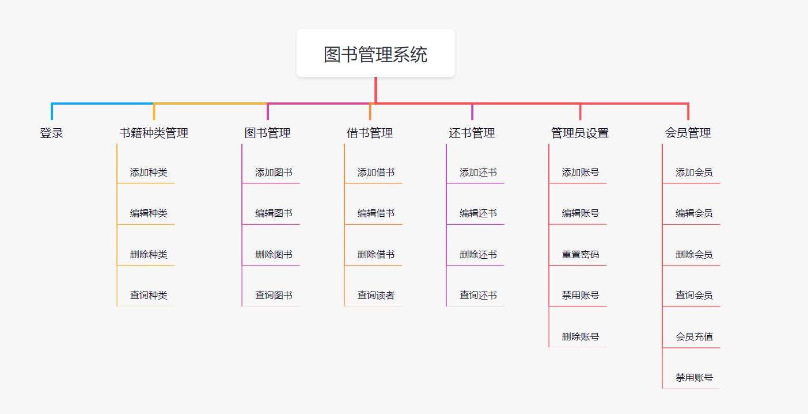

# 总览



## 第一节：搭建脚手架

### 准备知识

javaSE、servlet、JDBC、Maven、Mybatis、SpringMVC、SSM（了解）、Springboot

Mysql数据库简单的SQL语法

HTML、CSS、JS、vue2相关语法

### 安装软件

关注公众号：Java学习指南，回复：软件

idea（写代码软件）、nodejs（前端开发环境）、jdk（后端开发环境）、mysql5.7\8.0（数据库）、navicat（数据库可视化）、notepad++（文本编辑器，可选）、postman（接口调试工具，可选）

### 创建vue工程

`npm config set registry https://registry.npm.taobao.org`

安装 vue/cli：https://cli.vuejs.org/zh/guide/installation.html

@vue/cli@5.0.8

### 使用elementUI

官网：https://element.eleme.cn/

安装 ElementUI
```
npm i element-ui -S
```

```
import ElementUI from 'element-ui';
import 'element-ui/lib/theme-chalk/index.css';


Vue.use(ElementUI);
```

## 完成主页布局

### 头部

图标网站：https://www.iconfont.cn/

```
<!-- 头部区域 -->
<div style="height: 60px; line-height: 60px; background-color: white; margin-bottom: 2px">
  
  <span style="margin-left: 25px; font-size: 24px">图书管理系统</span>
</div>
```

### 左侧菜单

```
<!-- 侧边栏导航 -->
<div style="width: 200px; min-height: calc(100vh - 62px); overflow: hidden; margin-right: 2px; background-color: white">
  <el-menu :default-active="$route.path" :default-openeds="['/']" router class="el-menu-demo">
    <el-menu-item index="/">
      <i class="el-icon-eleme"></i>
      <span>首页</span>
    </el-menu-item>
    <el-submenu index="/">
      <template slot="title">
        <i class="el-icon-question"></i>
        <span>关于页面</span>
      </template>
      <el-menu-item index="about">关于详情</el-menu-item>
    </el-submenu>
  </el-menu>
</div>
```

### 右侧主体

```
  <!-- 主体数据 -->
<div style="flex: 1; background-color: white; padding: 10px">
  <router-view/>
</div>
```

### 写个表格试试

```
<!--    搜索表单-->
<div style="margin-bottom: 20px">
  <el-input style="width: 240px" placeholder="请输入名称"></el-input>
  <el-input style="width: 240px; margin-left: 5px" placeholder="请输入联系方式"></el-input>
  <el-button style="margin-left: 5px" type="primary"><i class="el-icon-search"></i> 搜索</el-button>
</div>

<el-table :data="tableData" stripe>
  <el-table-column prop="name" label="名称"></el-table-column>
  <el-table-column prop="age" label="年龄"></el-table-column>
  <el-table-column prop="address" label="地址"></el-table-column>
  <el-table-column prop="phone" label="联系方式"></el-table-column>
  <el-table-column prop="sex" label="性别"></el-table-column>
</el-table>

<!--    分页-->
<div style="margin-top: 20px">
  <el-pagination
      background
      :page-size="5"
      layout="prev, pager, next"
      :total="100">
  </el-pagination>
</div>


tableData: [
  { name: '王二', age: 20, address: '北京市', phone: '13899008899', sex: '男' },
  { name: '王二', age: 20, address: '北京市', phone: '13899008899', sex: '男' },
  { name: '王二', age: 20, address: '北京市', phone: '13899008899', sex: '女' },
]
```

## 搭建后台服务

### 跨域错误
> Access to fetch at 'http://localhost:9090/user/list' from origin 'http://localhost:8080' has been blocked by CORS policy: No 'Access-Control-Allow-Origin' header is present on the requested resource. If an opaque response serves your needs, set the request's mode to 'no-cors' to fetch the resource with CORS disabled.

如何解决？   @CrossOrigin

百度：SpringBoot如何解决跨域问题 / Vue如何解决跨域问题

### Mybatis官网示例

https://mybatis.net.cn/getting-started.html

```xml
<?xml version="1.0" encoding="UTF-8" ?>
<!DOCTYPE mapper
  PUBLIC "-//mybatis.org//DTD Mapper 3.0//EN"
  "http://mybatis.org/dtd/mybatis-3-mapper.dtd">
<mapper namespace="org.mybatis.example.BlogMapper">
  <select id="selectBlog" resultType="Blog">
    select * from Blog where id = #{id}
  </select>
</mapper>
```

安装MybatisX插件

错误：
> org.apache.ibatis.binding.BindingException: Invalid bound statement (not found): com.example.springboot.mapper.UserMapper.listUsers

如何解决？配置 mapper.xml

## 后台增删改查

pageHelper
```xml
<dependency>
    <groupId>com.github.pagehelper</groupId>
    <artifactId>pagehelper-spring-boot-starter</artifactId>
    <version>1.4.5</version>
</dependency>
```

### axios安装和使用

> npm i axios -S

axios封装request.js

```javascript
import axios from 'axios'

const request = axios.create({
	baseURL: '/api',  // 注意！！ 这里是全局统一加上了 '/api' 前缀，也就是说所有接口都会加上'/api'前缀在，页面里面写接口的时候就不要加 '/api'了，否则会出现2个'/api'，类似 '/api/api/user'这样的报错，切记！！！
    timeout: 5000
})

// request 拦截器
// 可以自请求发送前对请求做一些处理
// 比如统一加token，对请求参数统一加密
request.interceptors.request.use(config => {
    config.headers['Content-Type'] = 'application/json;charset=utf-8';
  
 // config.headers['token'] = user.token;  // 设置请求头
    return config
}, error => {
    return Promise.reject(error)
});

// response 拦截器
// 可以在接口响应后统一处理结果
request.interceptors.response.use(
    response => {
        let res = response.data;
        // 兼容服务端返回的字符串数据
        if (typeof res === 'string') {
            res = res ? JSON.parse(res) : res
        }
        return res;
    },
    error => {
        console.log('err' + error) // for debug
        return Promise.reject(error)
    }
)


export default request
```

删除sql报错：

> java.sql.SQLSyntaxErrorException: You have an error in your SQL syntax; check the manual that corresponds to your MySQL server version for the right syntax to use near 'where id = 12' at line

如何解决？检查sql语法

常见的错误：
> java.lang.IllegalArgumentException: Source must not be null

为什么会出现这个错误？
因为写代码的时候未考虑异常情况，新手常犯错误！

### 全局异常处理

```java
import com.example.springboot.common.Result;
import lombok.extern.slf4j.Slf4j;
import org.springframework.web.bind.annotation.ExceptionHandler;
import org.springframework.web.bind.annotation.RestControllerAdvice;

@Slf4j
@RestControllerAdvice
public class ExceptionHandle {

    @ExceptionHandler(value = ServiceException.class)
    public Result serviceExceptionError(ServiceException e) {
        log.error("业务异常", e);
        return Result.error(e.getMessage());
    }

    @ExceptionHandler(value = Exception.class)
    public Result exceptionError(Exception e) {
        log.error("系统错误", e);
        return Result.error("系统错误");
    }

}

```

```java
public class ServiceException extends RuntimeException{

    public ServiceException(String message) {
        super(message);
    }

}
```

## 登录和数据安全

js-cookie的使用

```
npm i js-cookie -S

// 导入使用

import Cookies from 'js-cookie'

Cookies.set('user', obj)  // 默认失效时间为该网站关闭时
Cookies.set('user', obj, { expires: 1 })  // 1天过期

Cookies.get('user')  // 获取cookie数据

Cookies.remove('user')  // 删除cookie数据
```

```sql
-- 清空表数据
TRUNCATE table admin;
```

> ### Cause: com.mysql.cj.jdbc.exceptions.MysqlDataTruncation: Data truncation: Data too long for column 'password' at row 1
> 数据字段设置的长度不够
> 

## 路由守卫

```javascript
// 404路由：
 {
    path: '*',
        component: () => import('@/views/404.vue'),
}

router.beforeEach((to, from, next) => {
    if (to.path === '/login') next()
    const admin = Cookies.get("admin")
    if (!admin && to.path !== '/login') return next("/login")
    next()
})
```

> 错误：Uncaught (in promise) Error: Redirected when going from "/login" to "/home" via a navigation guard.
> 
> 原因：cookie数据没存，就发生了跳转，我们应该先存数据，再跳转
> 
> if (res.data !== null) {
Cookies.set('admin', JSON.stringify(res.data))
}
this.$router.push('/')
> 

```java
//  设置自定义头配置

import org.springframework.context.annotation.Bean;
import org.springframework.context.annotation.Configuration;
import org.springframework.web.cors.CorsConfiguration;
import org.springframework.web.cors.UrlBasedCorsConfigurationSource;
import org.springframework.web.filter.CorsFilter;

@Configuration
public class CorsConfig {


    @Bean
    public CorsFilter corsFilter() {
        UrlBasedCorsConfigurationSource source = new UrlBasedCorsConfigurationSource();
        CorsConfiguration corsConfiguration = new CorsConfiguration();
        corsConfiguration.addAllowedOrigin("*"); // 1 设置访问源地址
        corsConfiguration.addAllowedHeader("*"); // 2 设置访问源请求头
        corsConfiguration.addAllowedMethod("*"); // 3 设置访问源请求方法
        source.registerCorsConfiguration("/**", corsConfiguration); // 4 对接口配置跨域设置
        return new CorsFilter(source);
    }
}
```

## 滑块验证

开源插件地址：https://gitee.com/monoplasty/vue-monoplasty-slide-verify

```javascript
npm i vue-monoplasty-slide-verify -S

import SlideVerify from 'vue-monoplasty-slide-verify';
Vue.use(SlideVerify);
```

```
<el-card class="cover" v-if="loginAdmin.id">
      <slide-verify :l="42"
                    :r="10"
                    :w="310"
                    :h="155"
                    slider-text="向右滑动"
                    @success="onSuccess"
                    @fail="onFail"
                    @refresh="onRefresh"
      ></slide-verify>
    </el-card>
    
    
函数：
  onSuccess() {
      Cookies.set('admin', JSON.stringify(this.loginAdmin))
      this.$router.push('/')
      this.$notify.success("登录成功")
    },
    onFail() {
      
    },
    onRefresh() {
      console.log('refresh')
    }
    
.cover {
  width: fit-content;
  background-color: white;
  position: absolute;
  top:50%;
  left:50%;
  transform: translate(-50%, -50%);
  z-index: 1000;
}
```

